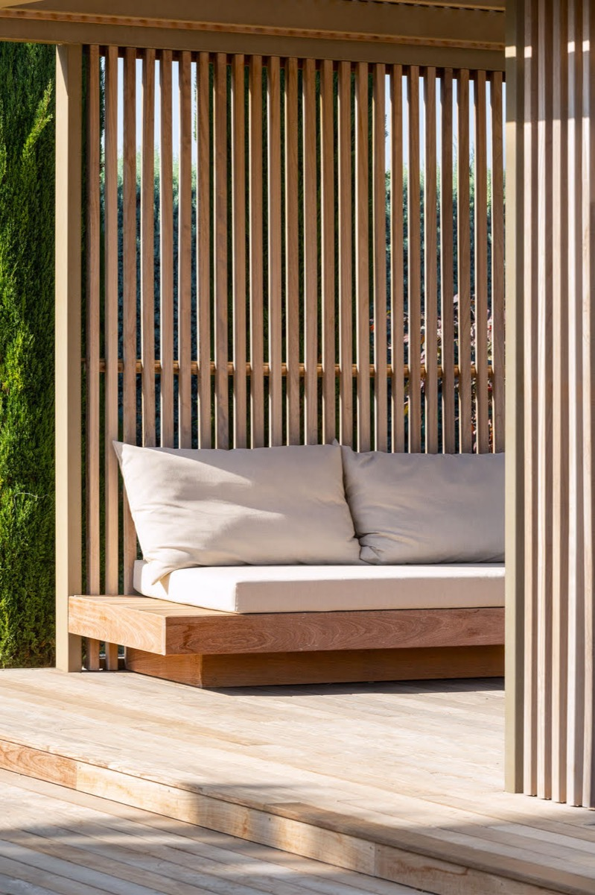
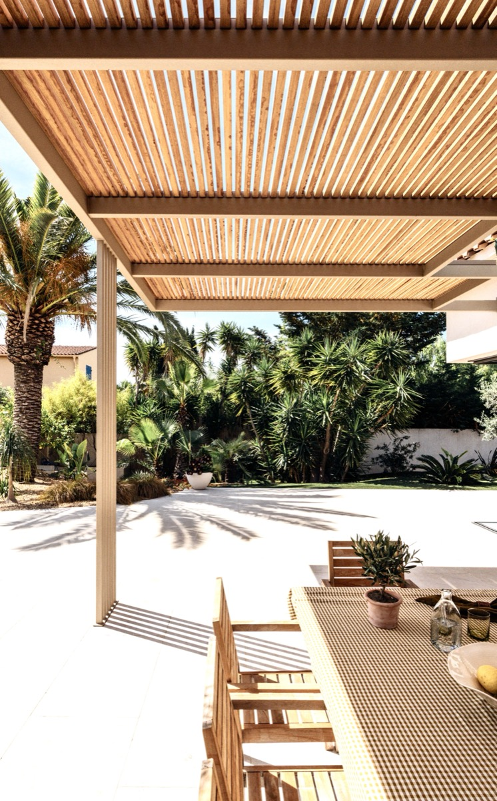
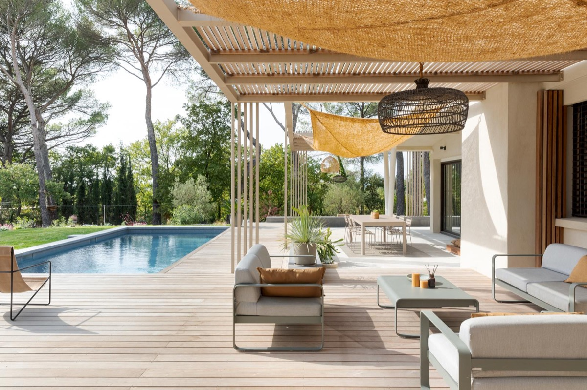
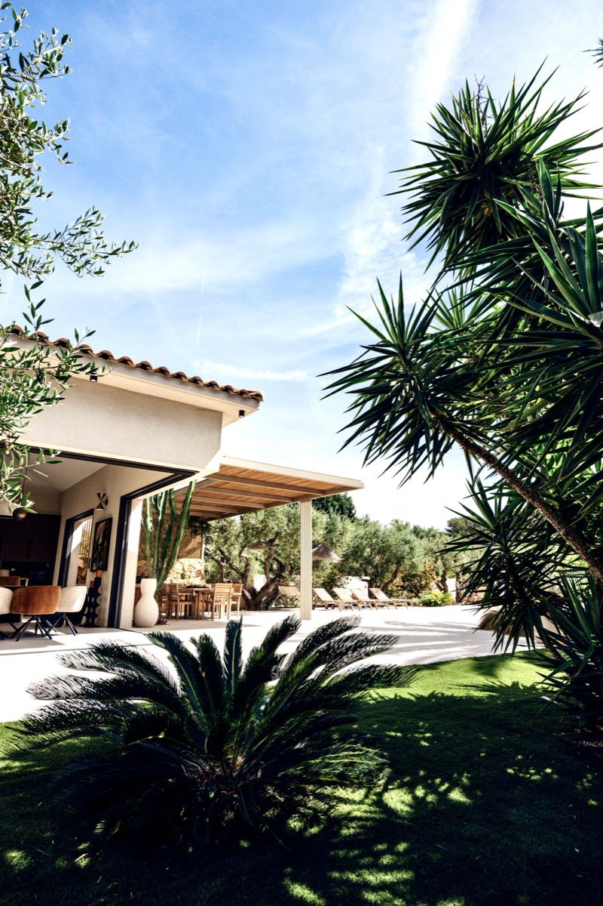
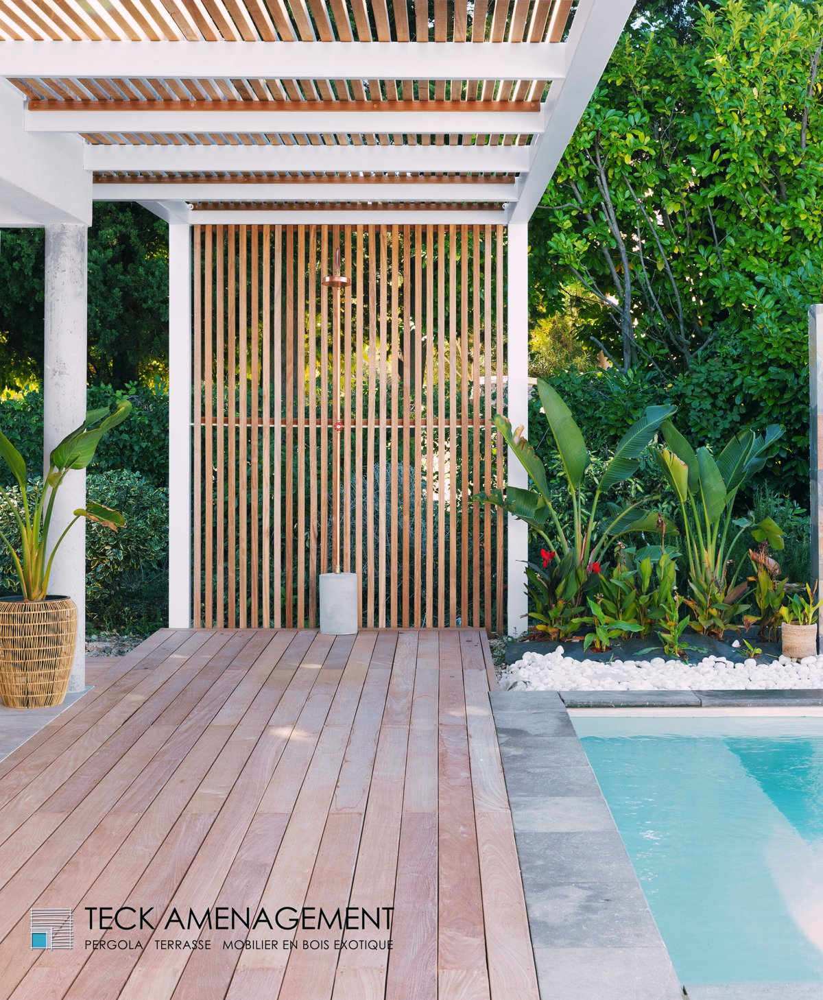
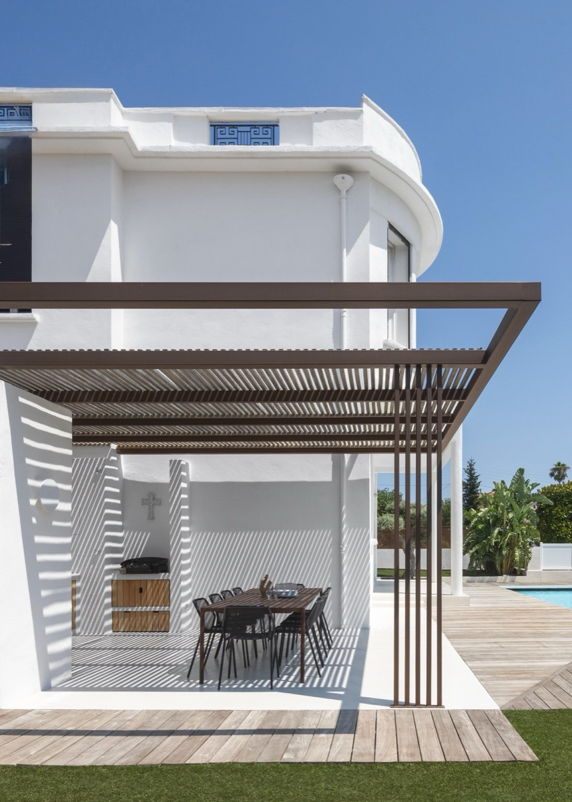
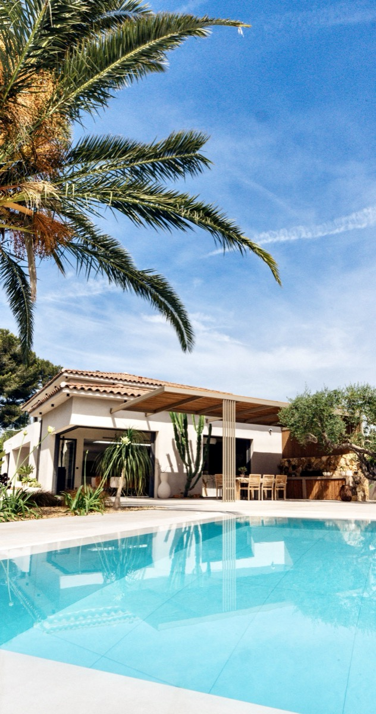
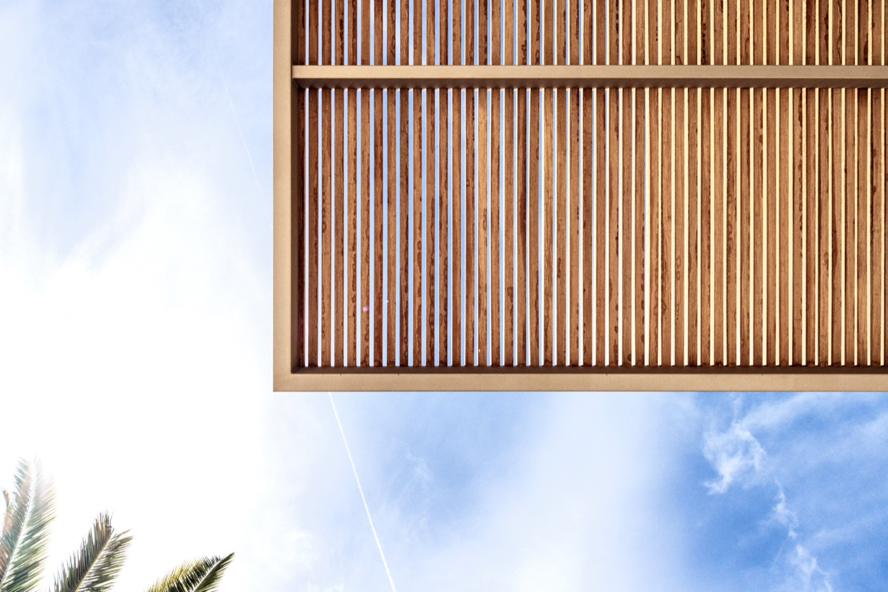

# Calendrier éditorial Instagram — Teck Aménagement

**Version interactive :** ouvre [index.html](index.html) dans le navigateur (vue Posts + vue Calendrier, glisse-dépose, bouton Copier, aux couleurs du dashboard Teck). Ce fichier Markdown est la version texte de secours.

> ✅ **Les 3 formats sont dans le calendrier interactif** : 8 posts photo, 5 reels, 14 stories. Chaque contenu porte une **mention de format** (📷 POST · 🎬 REEL · ⚡ STORY), en carte comme dans la grille du mois, et on peut filtrer par format.

**Numérotation :** les posts sont numérotés **#1 à #8 par ordre de date de publication**.

**Règles de calibrage :** légende entre 150 et 400 caractères (signature de marque imposée et hashtags NON comptés), signature exacte, crédit photo `📸 Merci @gabrielle_voinot pour la photo` juste avant les 5 hashtags, vouvoiement, aucun cadratin.

**Meilleurs horaires (sourcés : deck Teck, analyse des 50 derniers posts, heures Paris) :** mardi **18h00** (meilleur créneau, top post à 1490 interactions), vendredi **19h00**, lundi 18h00. Meilleurs jours : mardi > vendredi > lundi. Éviter mercredi/jeudi.

## 🗓️ Planning global — 3 formats, 3 jours différents

Aucun format ne tombe le même jour qu'un autre, pour ne pas se cannibaliser.

| Format | Jour | Heure | Rythme |
|---|---|---|---|
| **Post photo** | **mardi** | 18h00 | 1/semaine |
| **Reel** | **vendredi** | 19h00 | 1/semaine, 5 semaines (les 5 reels) |
| **Story** | **lundi** + **jeudi** | 18h00 / 19h00 | 2/semaine |

**Pourquoi ces jours :** mardi et vendredi sont les deux meilleurs créneaux du compte (sourcé : analyse des 50 derniers posts). Le **lundi** ouvre la semaine, le **jeudi** prépare le reel du lendemain. On évite le mercredi et le week-end.

**Rotation des stories :**
- **Lundi = story « valeur / info »** (un conseil, un détail, l'élégance), titre en capitales et texte en écriture normale.
- **Jeudi = story avis client** (carte témoignage) **ou** story qui prépare le reel du lendemain.
- ⚠️ Ne jamais réutiliser un avis déjà passé : cocher dans [avis-clients-suivi.md](avis-clients-suivi.md).

### Les 14 stories, lundi + jeudi

| Date | Story | Statut |
|---|---|---|
| lun. 13 juil. · 18h | Le soleil s'arrête où vous décidez | ✅ Maquette prête |
| **mar. 14 juil. · 11h** | Bon 14 juillet (**exception ponctuelle**) | ✅ Maquette prête |
| jeu. 16 juil. · 19h | **Avis client · Jean-Luc Vinet** | ⏳ Carte témoignage à faire |
| lun. 20 juil. · 18h | Une douche dehors, sans être vu | ✅ Maquette prête |
| jeu. 23 juil. · 19h | Un bois qui ne demande aucun entretien | ✅ Prépare le Reel #3 du lendemain |
| lun. 27 juil. · 18h | Le détail qu'on ne voit qu'au soleil | ✅ Maquette prête |
| jeu. 30 juil. · 19h | L'ombre n'est pas l'obscurité | ✅ Prépare le Reel #7 du lendemain |
| lun. 3 août · 18h | Le moment où la structure devient un lieu | ✅ Maquette prête |
| jeu. 6 août · 19h | **Avis client · Hélène Gruter** | ⏳ Carte témoignage à faire |
| lun. 10 août · 18h | Tout se joue au millimètre | ✅ Maquette prête |
| jeu. 13 août · 19h | Teck Aménagement, ce n'est pas que la pergola | ✅ Maquette prête |
| lun. 17 août · 18h | Elle ne s'ajoute pas à la maison, elle la prolonge | ✅ Maquette prête |
| jeu. 20 août · 19h | Habiller votre pergola (4 équipements) | ✅ Maquette prête |
| lun. 24 août · 18h | Nos pergolas n'ont pas de limite de longueur | ✅ Maquette prête |

> Les 2 stories avis tombent un jeudi. Les autres jeudis sont pris par les stories qui préparent le reel du vendredi, parce que l'enchaînement story → reel est plus fort éditorialement. Dès que d'autres cartes témoignage seront prêtes, on reviendra à une alternance stricte un jeudi sur deux.

### Les 5 reels, un par vendredi

| Date | Reel | Statut |
|---|---|---|
| ven. 17 juil. · 19h | **#1 — La vidéo du thermomètre** | ✅ Déjà tournée, à monter |
| ven. 24 juil. · 19h | **#3 — Le bois et l'entretien** (+ preuve -13°) | ✅ Prêt à tourner |
| ven. 31 juil. · 19h | **#7 — La luminosité** (+ citation de Mathieu) | ✅ Prêt à tourner |
| ven. 7 août · 19h | **#6 — Les 4 détails d'un projet réussi** | ✅ Prêt à tourner |
| ven. 14 août · 19h | **#2 — Visitez votre pergola avant qu'elle existe** (3D) | ✅ Prêt à monter · remplace le reel « bois », abandonné |

> Scripts complets : [scripts-reels.md](scripts-reels.md) · PDF client : [pdf/](pdf/)

### Semaine type (exemple, semaine du 13 juillet)

| Lundi 13 | Mardi 14 | Jeudi 16 | Vendredi 17 |
|---|---|---|---|
| Story valeur | **Post #2** (déjeuner à l'ombre) | Story **avis client** | **Reel #1** (thermomètre) |

---

## Planning des posts photo (1 post/semaine, mardi)

| # | Date | Heure | Angle | Statut |
|---|------|-------|-------|--------|
| 1 | ven. 10 juil. 2026 | 19h00 | Daybed · bois exotique | Planifié |
| 2 | mar. 14 juil. 2026 | 18h00 | Déjeuner à l'ombre | Planifié |
| 3 | mar. 21 juil. 2026 | 18h00 | Confort et fraîcheur | Planifié |
| 4 | mar. 28 juil. 2026 | 18h00 | S'intègre à toute maison | Planifié |
| 5 | mar. 4 août 2026 | 18h00 | Focus claustra | Planifié |
| 6 | mar. 11 août 2026 | 18h00 | Personnalisation / sur-mesure | Planifié |
| 7 | mar. 18 août 2026 | 18h00 | Coin d'ombre piscine | Planifié |
| 8 | mar. 25 août 2026 | 18h00 | Contre-plongée, rêver du bois | Planifié |

> **Couverture :** 8 posts → du 10 juillet au **25 août 2026**, à raison d'1 post/semaine. ✅

---

## #1 — ven. 10 juil. · 19h00 · Daybed, bois exotique



*Photo : `0 Maison R Aix 11.jpg`*

```
Et si vous n'aviez plus jamais besoin d'entretenir votre bois chez vous ?

Le bois exotique que nous utilisons garde sa teinte et sa chaleur au fil des saisons, sans le poncer ni l'huiler.

Vous profitez de votre extérieur au lieu de l'entretenir.

Teck Aménagement... Une nouvelle gamme de pergolas pour sublimer votre extérieur 🖊️

📸 Merci @gabrielle_voinot pour la photo

#TeckAménagement #BoisExotique #SansEntretien #TerrasseBois #Provence
```

---

## #2 — mar. 14 juil. · 18h00 · Déjeuner à l'ombre



```
À midi, la table est mise à l'ombre et le déjeuner peut durer.

Sous la pergola, la chaleur reste dehors pendant que vous mangez au frais.

On sort les verres, les rires fusent et le repas s'étire en famille.

Cette nappe à carreaux a ce petit air d'été qui ne vieillit jamais.

Teck Aménagement... Une nouvelle gamme de pergolas pour sublimer votre extérieur 🖊️

📸 Merci @mishka_vision pour la photo

#TeckAménagement #PergolaSurMesure #ArtDeRecevoir #TerrasseOmbragée #Provence
```

---

## #3 — mar. 21 juil. · 18h00 · Confort et fraîcheur



*Photo : `1 Maison Sanary 8 - Filter.jpg`*

```
Sous cette pergola, la chaleur de l'été n'entre pas.

La densité du bois filtre le soleil quand la structure aérée laisse l'air circuler librement.

La brise d'été traverse l'espace et rafraîchit naturellement.

Vous vous installez, vous respirez, vous profitez et…
Vous vous sentez bien.

Teck Aménagement... Une nouvelle gamme de pergolas pour sublimer votre extérieur 🖊️

📸 Merci @gabrielle_voinot pour la photo

#TeckAménagement #PergolaSurMesure #ConfortExtérieur #Ombrage #Provence
```

---

## #4 — mar. 28 juil. · 18h00 · S'intègre à toute maison



```
Peur qu'une pergola dénature votre maison ? C'est tout l'inverse.

Quel que soit le style de votre façade, nous la dessinons pour épouser votre architecture.

Elle s'intègre avec naturel et vient sublimer votre maison, sans jamais en rompre l'harmonie.

Teck Aménagement... Une nouvelle gamme de pergolas pour sublimer votre extérieur 🖊️

📸 Merci @gabrielle_voinot pour la photo

#TeckAménagement #PergolaSurMesure #ArchitectureExtérieure #AménagementExtérieur #Provence
```

---

## #5 — mar. 4 août · 18h00 · Focus claustra



*Photo : `4 Maison Cabries 5 - Filter.jpg` (recadrée, voile de coco retiré)*

```
Le claustra, c'est ce détail qui fait toute la différence.

Ces fins carrelets de bois filtrent le regard et la lumière sans jamais enfermer l'espace.

Elles créent de l'intimité, ici autour d'une douche extérieure, tout en gardant la structure ouverte et aérée.

Un brise-vue qui devient un vrai élément de décor.

Teck Aménagement... Une nouvelle gamme de pergolas pour sublimer votre extérieur 🖊️

📸 Merci @gabrielle_voinot pour la photo

#TeckAménagement #Claustra #BriseVue #BoisExotique #Provence
```

---

## #6 — mar. 11 août · 18h00 · Personnalisation / sur-mesure



*Photo : `kar_teck_voinot_6.jpg`*

```
Aucune de nos pergolas ne ressemble à une autre.

Celle-ci a été dessinée pour cette villa, ses courbes et son style unique.

Structure, dimensions, teinte du bois, jeu d'ombres : tout se pense avec vous, selon votre maison et votre façon de vivre dehors.

Teck Aménagement... Une nouvelle gamme de pergolas pour sublimer votre extérieur 🖊️

📸 Merci @gabrielle_voinot pour la photo

#TeckAménagement #PergolaSurMesure #BoisExotique #DesignExtérieur #Provence
```

---

## #7 — mar. 18 août · 18h00 · Coin d'ombre au bord de la piscine



```
Après la baignade, l'ombre vous attend à deux pas de l'eau.

Juste à côté de la piscine, la pergola crée un coin frais où l'on se pose sans quitter le bord.

Le temps d'un goûter pour les enfants ou d'un jus de fruit à l'ombre, l'été devient plus doux.

Teck Aménagement... Une nouvelle gamme de pergolas pour sublimer votre extérieur 🖊️

📸 Merci @mishka_vision pour la photo

#TeckAménagement #PergolaSurMesure #Piscine #ConfortExtérieur #Provence
```

---

## #8 — mar. 25 août · 18h00 · Contre-plongée, rêver du bois



*Photo : `_LVM1657.jpg` (villa impian)*

> ✅ **Témoignage réel intégré.** Avis d'Adrienne Riera (Nîmes), 5★, sourcé dans les Stories à la une « Témoignages » de Teck.

```
Et si c'était vous, allongé sur votre transat, le regard levé vers le bois de votre pergola ?

Des carrelets de bois exotique qui découpent le ciel et filtrent le soleil.
La lumière glisse entre eux et dessine des ombres qui bougent avec les heures.
On lève les yeux et le temps ralentit.

« Je ne peux que vous recommander ces pergolas de très bonne qualité et au design juste DE FOLIE !!! »
Adrienne Riera, Nîmes

Teck Aménagement... Une nouvelle gamme de pergolas pour sublimer votre extérieur 🖊️

📸 Merci @mishka_vision pour la photo

#TeckAménagement #PergolaBois #BoisExotique #Provence #ArtDeVivre
```
